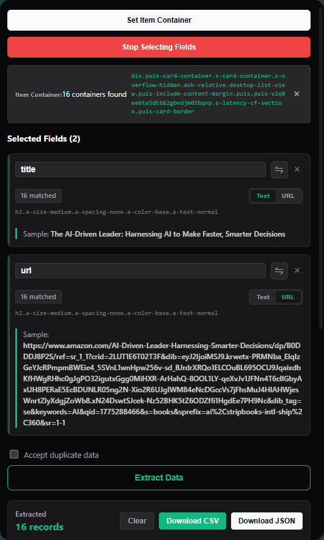
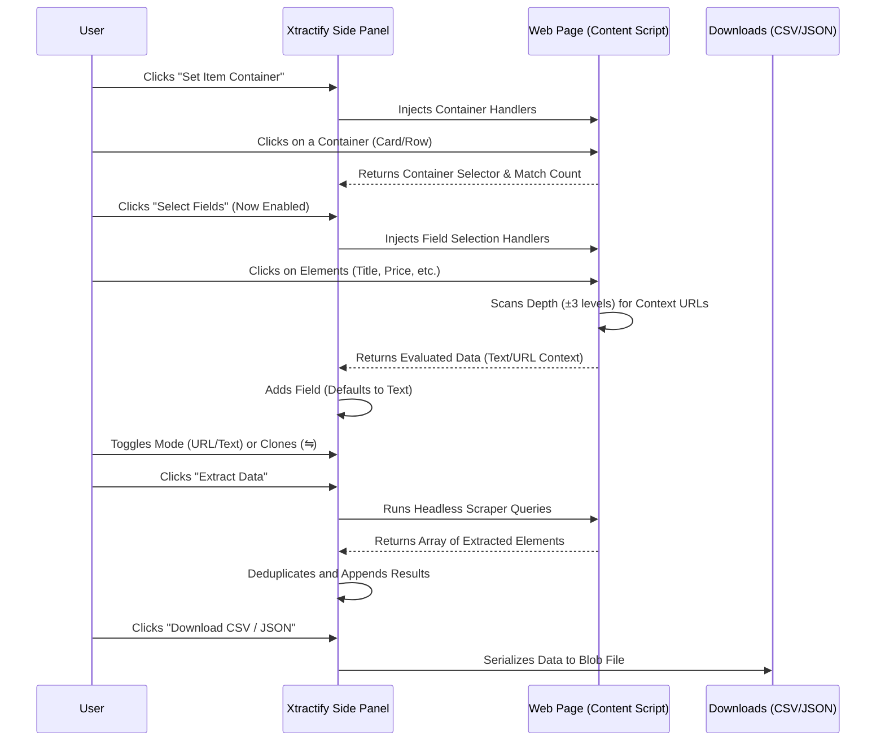

<h1>
   
  Xtractify - Web Scraping Extension
</h1>

<p>
  Xtractify is a powerful, AI-assisted Chrome Extension that simplifies web scraping. Easily extract text, links, and images from any website using an intuitive point-and-click interface, and export the structured data directly to CSV or JSON formats.
</p>

<p>
  
</p>

## Features

- **Mandatory Container Selection**: To ensure data structure integrity, you must first define an **Item Container** (like a table row or product card) before selecting individual fields.
- **Advanced Context Discovery (Depth System)**: Smart logic that scans **3 levels deep** (children) and **3 levels up** (parents) to find nearby URLs. Never miss a link, even if you click a nested title span!
- **Dynamic Mode Toggles**: Inside every field card, you can instantly toggle between **URL** and **Text** extraction with a single click.
- **One-Click Clones (⇋)**: Use the "Extract Other Mode" button to instantly create a duplicate field for the same element but with the alternative extraction mode.
- **Auto-Cleanup**: Removing an Item Container automatically clears all child fields, keeping your workspace organized.
- **Data Deduplication**: Automatically prevents redundant records by calculating data hashes for every row.
- **Instant Exports**: Effortlessly export captured metrics via built-in browser blob downloads (CSV & JSON)—no external servers required!

## Application Workflow

Here is how the data flow and UI logic are structured:



## Quick Start Development

1. Install all required dependencies:
   ```bash
   npm install
   ```

2. Start the Vite development server (which enables Hot Module Replacement tailored for Extensions):
   ```bash
   npm run dev
   ```

3. Load the Extension into Google Chrome:
   - Go to `chrome://extensions/`
   - Enable **"Developer mode"** in the top right corner.
   - Choose **"Load unpacked"**.
   - Navigate to the `dist` folder generated inside this repository.

4. Pin the extension to access the Side Panel easily when navigating the web!

## Building for Production

Compile your source files strictly via TypeScript and generate a minified build:

```bash
npm run build
```
*(This produces an optimized deployment inside the `dist` folder alongside an archive zip output).*

## Technologies Used

* **React 19**
* **Vite**
* **Typescript 5**
* **CRXJS** (Vite Plugin specific for Manifest V3 extension loading)

## License

This project is licensed under the MIT License - see the LICENSE file for details.
