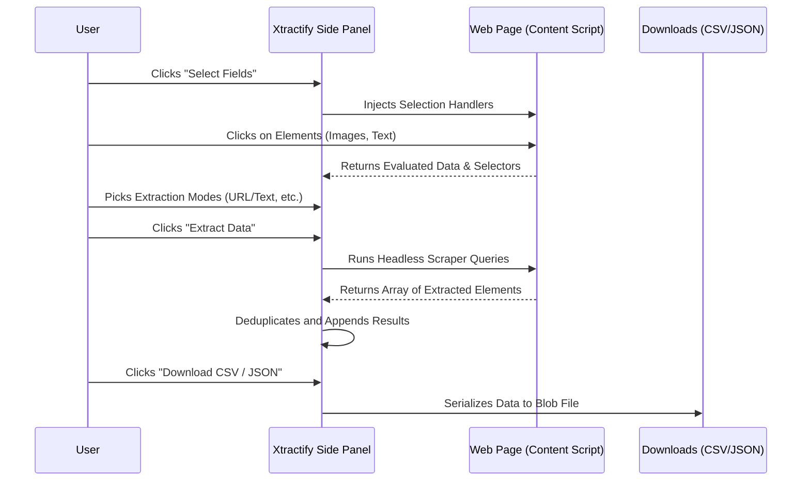

<h1>
   
  Xtractify - Web Scraping Extension
</h1>

<p>
  Xtractify is a powerful, AI-assisted Chrome Extension that simplifies web scraping. Easily extract text, links, and images from any website using an intuitive point-and-click interface, and export the structured data directly to CSV or JSON formats.
</p>

## Features

- **Point & Click Selection**: Select "Item Containers" (like table rows or cards) and pick individual fields to extract.
- **Deep Compatibility**: Supports extracting raw text, active hyperlinks (URLs), and image sources (including attributes like `alt` and `<picture>` formats).
- **Data Deduplication**: Prevents you from pulling identical records by calculating data hashes automatically.
- **Smart Formatting**: Extract URLs vs Texts dynamically as per your requirements natively within the Side panel.
- **Instant Exports**: Effortlessly export captured metrics via built-in browser blob downloads (CSV & JSON)—no external servers required!
- **React & Vite Built**: Modern, rapid, and fully hot-reloadable Developer Experience using the CRXJS plugin.

## Application Workflow

Here is how data flows through our extension logically:



## Quick Start Development

1. Install all required dependencies:
   ```bash
   npm install
   ```

2. Start the Vite development server (which enables Hot Module Replacement tailored for Extensions):
   ```bash
   npm run dev
   ```

3. Load the Extension into Google Chrome:
   - Go to `chrome://extensions/`
   - Enable **"Developer mode"** in the top right corner.
   - Choose **"Load unpacked"**.
   - Navigate to the `dist` folder generated inside this repository.

4. Pin the extension to access the Side Panel easily when navigating the web!

## Building for Production

Compile your source files strictly via TypeScript and generate a minified build:

```bash
npm run build
```
*(This produces an optimized deployment inside the `dist` folder alongside an archive zip output).*

## Technologies Used

* **React 19**
* **Vite**
* **Typescript 5**
* **CRXJS** (Vite Plugin specific for Manifest V3 extension loading)

## License

This project is licensed under the MIT License - see the LICENSE file for details.
