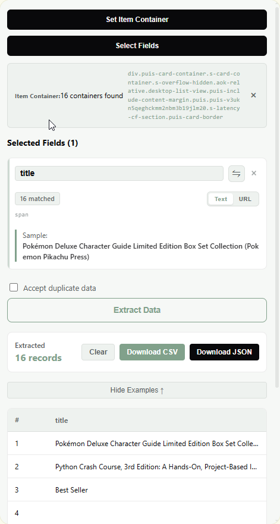
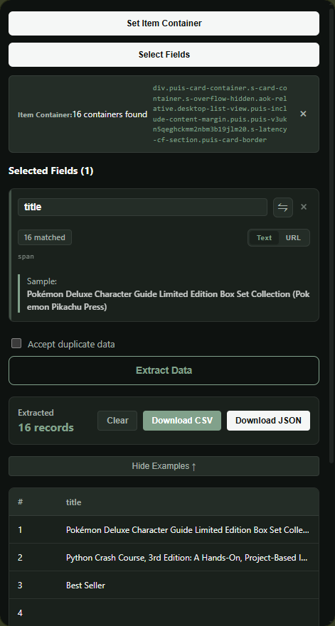
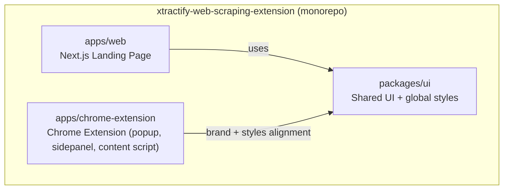
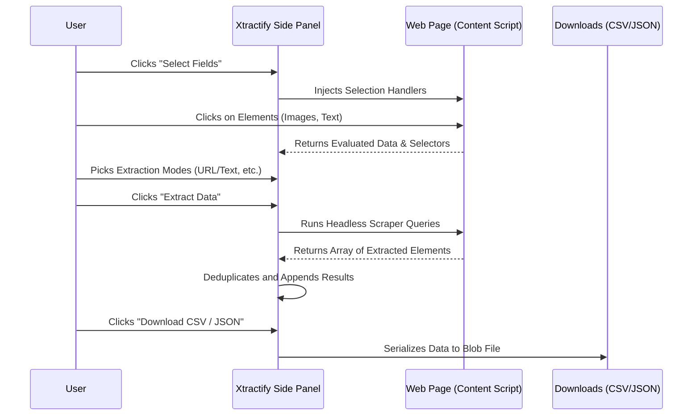

<div style="display:flex;align-items:center;gap:12px;">
  
  <h1 style="margin:0;">Xtractify</h1>
</div>

Xtractify is a no-code web scraping Chrome extension with a companion landing page for downloading and installing the extension.

<p>
  
  
</p>

## Monorepo structure

- **Extension**: `apps/chrome-extension`
- **Landing page**: `apps/web`
- **Shared UI**: `packages/ui`



## How it works



## What you get

- **No-code field selection**: pick a repeating container and click fields on the page.
- **Preview + export**: see extracted rows and download CSV/JSON.
- **Theme support**: UI follows device theme (light/dark) with consistent brand styling.

## Requirements

- **Node.js**: 20+
- **pnpm**: 9.15.9 (see root `package.json`)

## Setup

```bash
git clone https://github.com/lwshakib/xtractify-web-scraping-extension.git
cd xtractify-web-scraping-extension
pnpm install
```

## Run (development)

```bash
pnpm dev
```

### Run only one app

```bash
pnpm --filter web dev
pnpm --filter xtractify-web-scraping-extension dev
```

## Build

```bash
pnpm build
```

### Quality checks (same as CI)

```bash
pnpm format:check
pnpm lint
pnpm typecheck
pnpm build
```

## Install the extension (from ZIP or folder)

### Option A: Build locally → Load unpacked

1. Build the extension:

```bash
pnpm --filter xtractify-web-scraping-extension build
```

2. Open Chrome → `chrome://extensions`
3. Enable **Developer mode**
4. Click **Load unpacked**
5. Select the built extension folder:
   - `apps/chrome-extension/dist`

### Option B: Download ZIP → Unzip → Load unpacked

1. Download the ZIP from the landing page / GitHub release.
2. Unzip to a permanent folder.
3. Open Chrome → `chrome://extensions`
4. Enable **Developer mode**
5. Click **Load unpacked** and select the unzipped folder.

## Troubleshooting

- **Build fails fetching fonts**: this repo uses local/system fonts to avoid network-dependent builds.
- **Extension can’t scrape some pages**: Chrome blocks scripts on restricted pages like `chrome://` and the web store.
- **Formatting fails because of `.next`**: `apps/web/.prettierignore` ignores `.next/` so `format:check` stays clean.

## Contributing

See `CONTRIBUTING.md`.

## Code of conduct

See `CODE_OF_CONDUCT.md`.
